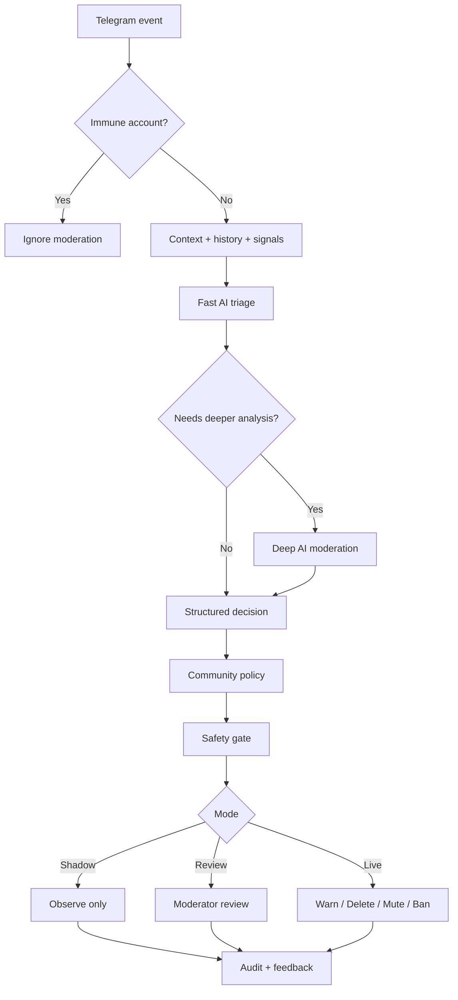

# ModGuard

**Context-aware AI moderation agent for Telegram communities.**

ModGuard combines local LLM reasoning, deterministic moderation policies, community-specific rules and human-controlled enforcement to detect spam, scams, raids, impersonation and abusive behavior without turning moderation into a black box.

> **Current public release:** `v1.2.0 — Safety & Identity Protection`

---

## Why ModGuard

Classic moderation bots are strong at fixed rules: banned words, flood limits, links and simple filters. They become much weaker when the decision depends on **intent, context, history or impersonation**.

ModGuard is designed for cases such as:

- hidden advertising without obvious keywords;
- scam messages written in natural language;
- repeated harassment that only becomes clear from conversation history;
- raid or coordinated spam behavior;
- fake admins / fake moderators impersonating trusted staff;
- community-specific rules that cannot be expressed as a single regex.

The AI does not act alone. Decisions pass through a policy and safety layer before enforcement.

---

## How it works



---

## Key features

### Context-aware AI moderation

- Fast → Deep LLM routing for efficient moderation.
- Conversation context and user history are included in decisions.
- Structured AI output is validated before enforcement.
- Community-specific policies can strengthen the baseline moderation rules.

### Real moderation actions

ModGuard can perform real Telegram moderation actions:

- warning;
- message deletion;
- temporary mute;
- ban;
- moderator review / ticket creation.

### Shadow / Review / Live operation

- **Shadow** — analyze violations without destructive actions.
- **Review** — uncertain cases are routed to a moderator.
- **Live** — validated decisions can be enforced automatically.

This makes gradual rollout possible before trusting automation in a real community.

### Raid Guard & semantic campaigns

- Detects coordinated bursts of suspicious activity.
- Tracks semantically similar messages instead of relying only on exact duplicates.
- Helps identify repeated scam / spam campaigns with multiple text variations.

### Moderator feedback memory

Moderator decisions are stored as feedback so confirmed patterns can be recognized again while remaining scoped to the relevant community.

### Diagnostics & audit

- Operational diagnostics for core services.
- Persistent moderation history.
- Audit trail for enforcement actions.
- Re-review and feedback workflows for disputed decisions.

---

## Safety & identity protection

### Immunity List

Trusted bots and service accounts can be fully excluded from moderation by Telegram username or user ID.

Immune accounts bypass:

- AI analysis;
- spam / scam / flood detection;
- semantic clustering;
- warnings;
- deletes;
- mutes;
- bans;
- moderation tickets.

This is useful for service bots, integrations and trusted automation accounts inside a community.

### Fake Admin / Fake Moderator detection

ModGuard distinguishes real Telegram administrators by their actual Telegram identity and role.

Suspicious accounts are checked for combinations of:

- similarity to a real administrator's username or display name;
- markers such as `Admin`, `Moderator`, `Support` or `Official`;
- suspicious links;
- wallet / seed / verification requests;
- financial solicitation;
- attempts to move users into private messages.

A suspicious name **alone is not enough** for enforcement. ModGuard requires impersonation signals together with dangerous behavior before escalating the case.

### Automatic Safety Circuit Breaker

ModGuard monitors its own moderation behavior.

If destructive actions or execution failures exceed safe thresholds, the affected community is automatically forced into persistent **Shadow Mode**.

Default safety conditions include:

- 5 mute / ban actions within 60 seconds;
- 20 destructive actions within 60 seconds;
- 3 Telegram execution failures within 120 seconds;
- 3 moderation-pipeline failures within 120 seconds.

After a safety trip, destructive actions stop and **Live Mode is not restored automatically**. Human review is required.

### Time-aware reputation

Minor violations should not punish a user forever.

LIGHT reputation for spam, flood and targeted harassment uses a configurable decay window. The default is **6 hours**.

Example:

```text
warning
→ repeated minor offense within 6h
→ escalation

warning
→ long inactivity
→ next minor offense starts from warning again
```

MEDIUM / HEAVY safety history is intentionally retained.

---

## Architecture

```text
app/
├── admin/                 # dashboard, audit, controls, diagnostics
├── agent/                 # context, prompts, moderation reasoning
├── bot/                   # Telegram handlers and callbacks
├── community_policy/      # per-community policy overlay
├── database/              # persistence and repositories
├── feedback/              # moderator feedback memory
├── llm/                   # local LLM providers
├── moderation/            # policy, execution, safety, identity checks
├── raid_guard/            # raid detection
├── semantic_clustering/   # semantic campaign detection
└── utils/                 # shared infrastructure
```

The public repository intentionally contains only the agent itself and its public moderation features.

---

## Tech stack

| Layer | Technology |
|---|---|
| Language | Python |
| Telegram | aiogram 3 |
| Local AI | Ollama |
| Validation | Pydantic |
| Database | SQLite + SQLAlchemy / aiosqlite |
| Async networking | aiohttp |
| Testing | pytest + pytest-asyncio |
| Semantic analysis | local embeddings |

---

## Testing

The public `v1.2.0` build was validated with the private commercial control plane physically absent.

```text
255 tests passed
3 full public regression runs passed
```

Run the test suite:

```powershell
python -m pytest -q
```

Compile check:

```powershell
python -m compileall -q app tests
```

---

## Getting started

### 1. Clone the repository

```bash
git clone <YOUR_REPOSITORY_URL>
cd modguard
```

### 2. Create a virtual environment

```powershell
python -m venv .venv
.venv\Scripts\Activate.ps1
```

### 3. Install dependencies

```powershell
pip install -r requirements.txt
```

### 4. Configure environment

Copy `.env.example` to `.env` and provide your Telegram bot token, administrator IDs and Ollama configuration.

### 5. Start Ollama models

Make sure the configured local models are available before starting ModGuard.

### 6. Run

```powershell
python run.py
```

or:

```powershell
python -m app.main
```

---

## Releases

### `v1.2.0 — Safety & Identity Protection` — current

Focus: hardening ModGuard for real-world community pilots.

**Added:**

- Immunity List for trusted bots and service accounts;
- Fake Admin / Fake Moderator protection;
- automatic per-community Safety Circuit Breaker;
- configurable LIGHT reputation decay;
- compact Settings / Safety & Tools separation;
- additional regression coverage for safety and identity flows.

**Validation:** `255 tests passed` in the public build.

### `v1.0.0 — Portfolio Release`

Initial frozen portfolio release demonstrating the core ModGuard architecture:

- local Fast → Deep LLM moderation;
- deterministic policy gate;
- community-specific policies;
- real Telegram enforcement actions;
- Shadow / Review / Live workflows;
- Raid Guard;
- semantic campaign detection;
- moderator feedback memory;
- audit and diagnostics.

> Full release notes are available in the repository's **Releases** section.

---

## Roadmap

- Real-world community pilot.
- Production deployment and monitoring tooling.
- Extended moderation analytics.
- Multi-community operational tooling.
- Additional platform integrations.

---

## Design principle

ModGuard is built around one rule:

> **AI interprets. Policy decides. Safety limits. Software executes. Humans remain in control.**

The goal is not maximum autonomy. The goal is reliable automation with explicit boundaries, observability and recovery paths.

---

## License

See the repository license for usage terms.
