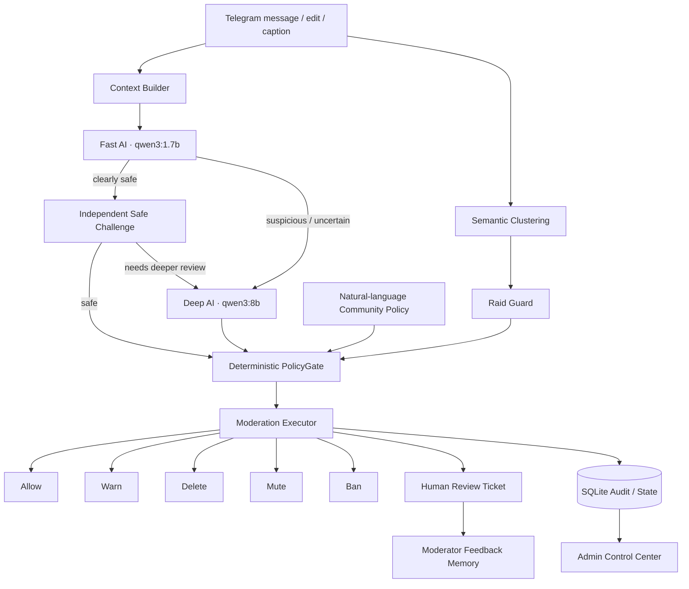

# ModGuard

### Local-first AI moderation agent for Telegram communities


**ModGuard** is a production-oriented moderation agent that combines local LLM reasoning with deterministic safety controls. It analyzes Telegram messages, executes moderation actions, detects coordinated campaigns, and escalates ambiguous human conflicts to a moderator instead of making unsafe guesses.

The core design principle is simple:

> **LLM reasoning → structured decision → deterministic policy → controlled execution**

ModGuard is not a keyword blacklist and not a chatbot that only gives advice. It performs real moderation actions while keeping destructive decisions behind explicit policy gates.

---

## Highlights

- **Fast → Deep AI routing** using separate local Qwen models
- **Real moderation actions:** Warn, Delete, Mute, Ban, Unban
- **Protected Core** for high-confidence scam, phishing, malicious links and credible threats
- **Progressive enforcement** for spam and flood
- **Human-review tickets** for ambiguous fights and contextual harassment
- **Natural-language Community Policy** with per-chat rules
- **Shadow Mode** for safe dry evaluation before live enforcement
- **Auto-ban kill switch** with temporary-mute fallback
- **Semantic campaign detection** using local embeddings
- **Raid Guard** for confirmed multi-user hostile campaigns
- **Moderator Feedback Memory** for chat-scoped gray-area decisions
- **Known Pattern Memory** for repeated confirmed malicious payloads
- **Multi-community isolation** with independent settings and policies
- **Telegram group → supergroup migration recovery**
- **Ban registry** with newest-first pagination, search and unban
- **Diagnostics** for Telegram, database, Ollama, Fast/Deep LLMs and embeddings
- **200+ automated regression tests**

---

## Architecture



A deeper architecture breakdown is available in [`docs/ARCHITECTURE.md`](docs/ARCHITECTURE.md).

---

## Safety Model

The LLM does **not** directly call Telegram moderation methods.

Every model decision is converted into structured data and validated by deterministic code before anything destructive can happen.

### Protected Core

High-confidence security violations can be handled autonomously:

- phishing / credential theft
- confirmed scam or fraud
- malicious links
- credible direct threats
- obvious coordinated spam campaigns

### Contextual behavior

Human conflict is intentionally more conservative:

- first clear targeted aggression → warning
- repeated or ambiguous conflict → moderator review
- unclear multi-party fights → moderator review
- moderator sees conversation context before deciding

### Additional safety controls

- **Shadow Mode:** observe decisions without destructive actions
- **Auto-ban OFF:** a BAN verdict falls back to temporary mute + delete
- **Current-message evidence:** history cannot make a harmless current message guilty
- **Semantic clustering is observational:** similarity alone cannot punish a message
- **Per-chat memory:** one community's behavioral history does not become another community's reputation

---

## Admin Control Center

ModGuard exposes an inline Telegram admin interface for each managed community:

- Dashboard and 24h activity
- Open review tickets
- Shadow / Live mode
- Auto-ban switch
- Mute duration
- Safety Policy
- Community Policy
- Raid Guard
- Ban search / pagination / unban
- Test Mode
- Diagnostics
- Multi-chat switching

Settings are isolated per Telegram community.

---

## Local AI Stack

| Role | Default model |
|---|---|
| Fast semantic triage | `qwen3:1.7b` |
| Deep moderation reasoning | `qwen3:8b` |
| Semantic embeddings | `qwen3-embedding:0.6b` |

All inference is performed through a local Ollama instance.

---

## Quick Start

### 1. Install and prepare Ollama

```bash
ollama pull qwen3:1.7b
ollama pull qwen3:8b
ollama pull qwen3-embedding:0.6b
```

### 2. Create a virtual environment

Windows PowerShell:

```powershell
python -m venv .venv
.venv\Scripts\Activate.ps1
python -m pip install -r requirements.txt
```

Linux / macOS:

```bash
python -m venv .venv
source .venv/bin/activate
python -m pip install -r requirements.txt
```

### 3. Configure ModGuard

Copy the example configuration:

```powershell
Copy-Item .env.example .env
```

Set at minimum:

```env
TELEGRAM_BOT_TOKEN=your_bot_token
ADMIN_IDS=your_telegram_user_id
```

Safe defaults ship with:

```env
DRY_RUN=true
LIVE_DELETE_ENABLED=false
```

Start in Shadow / dry-run mode before enabling live moderation.

### 4. Give the bot Telegram permissions

For full functionality the bot should be a group administrator with permission to:

- delete messages
- restrict members
- ban users

### 5. Run

```powershell
python run.py
```

`run.py` is the recommended launcher and exits cleanly on `Ctrl+C`.

---

## Testing

Install development dependencies:

```powershell
python -m pip install -r requirements-dev.txt
```

Run the regression suite:

```powershell
python -m pytest -v
```

The suite covers policy boundaries, false-positive guards, report re-review, community policies, moderation actions, semantic clustering, Raid Guard, feedback memory, chat migration, Test Mode and admin controls.

See [`docs/TESTING.md`](docs/TESTING.md) for the testing philosophy.

---

## Project Structure

```text
modguard/
├── app/
│   ├── admin/                  # Dashboard, settings, tickets, Test Mode
│   ├── agent/                  # Fast/Deep prompts, routing, structured decisions
│   ├── bot/                    # Telegram handlers
│   ├── community_policy/       # Natural-language per-chat policy overlay
│   ├── database/               # Async SQLite persistence
│   ├── feedback/               # Moderator feedback memory
│   ├── llm/                    # Ollama structured-output client
│   ├── moderation/             # PolicyGate and deterministic executor
│   ├── raid_guard/             # Multi-user campaign protection
│   ├── semantic_clustering/    # Embeddings and campaign observations
│   └── utils/                  # Caches, normalization, locks, throttling
├── docs/
│   ├── ARCHITECTURE.md
│   └── TESTING.md
├── tests/
├── .env.example
├── requirements.txt
├── requirements-dev.txt
└── run.py
```

---

## Engineering Focus

This project was built as a portfolio case study in practical AI automation. The interesting part is not just classification accuracy; it is designing a system where probabilistic model output can safely drive real-world actions.

Key engineering problems addressed:

- structured LLM output and repair
- fast/slow model routing
- false-positive containment
- current-message vs historical-context separation
- deterministic enforcement policy
- human-in-the-loop escalation
- async Telegram actions
- per-community state isolation
- semantic campaign detection without semantic overreach
- rollback-friendly ban management
- regression testing for previously observed failures

---

## Version

**ModGuard v1.0.0 — Portfolio Release**

The moderation core is treated as a frozen baseline for the portfolio version. Future work will focus primarily on deployment, operational tooling and commercial pilot infrastructure rather than changing the tested moderation behavior.

See [`CHANGELOG.md`](CHANGELOG.md).

---

## Security

Never commit a real `.env`, Telegram token, database, moderation logs or customer chat data.

See [`SECURITY.md`](SECURITY.md).

---

## Author

Built by **0xkentoshi** as part of an AI automation portfolio.

Open to opportunities in **AI automation, AI agents, Python automation and workflow automation**.
