<div align="center">

# 🛡️ ModGuard

### Local-first AI moderation agent for Telegram communities


**Local LLMs · Real moderation actions · Protected Core · Human review · Community-specific policy**

</div>

**ModGuard** is a production-oriented Telegram moderation agent that combines local LLM reasoning with deterministic safety controls.

It does more than classify messages. ModGuard builds conversational context, separates the current message from historical evidence, applies a protected safety baseline, overlays community-specific rules, and only then executes or simulates a moderation action.

> **Message → AI reasoning → Protected Core → Community Policy → Effective action → Audit**

The project is designed around one engineering problem: **how to let probabilistic AI drive real moderation actions without giving the model unrestricted control.**

---

## v1.5.0 — Major Update

This release is a substantial upgrade of the portfolio build.

### Decision truth and safety

- explicit decision provenance: **model → core → community policy → effective action**
- **Protected Core** for security-sensitive categories such as phishing and scam
- protected feedback boundary: community feedback cannot weaken protected security behavior into unsafe `ALLOW`
- **policy-family isolation** so, for example, scam history cannot escalate an unrelated harassment case
- same-message idempotency: re-reviewing one Telegram message cannot manufacture a fake repeat offense

### Smarter moderation context

- improved report-target re-review
- **Reporter Shield**: a user reporting a harmful message is not punished for the quoted/replied content
- explicit moderation-request detection
- improved banter boundary: mutual joking can remain allowed, while an explicit request to stop ends the friendly-banter exception
- current-message evidence remains separated from historical context

### Community policy

- natural-language rules compiled into structured enforcement rules
- deterministic security presets
- **Progressive security policy:** first confirmed security offense can be `MUTE + DELETE`, repeat offense `BAN + DELETE`
- community rules remain chat-scoped
- policy matching is constrained by moderation family before semantic matching

### Safer execution

- **Shadow Mode** for non-destructive evaluation
- capability checks before live restrictive actions
- Telegram group/supergroup limitations are handled explicitly
- real `WARN`, `DELETE`, `MUTE`, `BAN` and `UNBAN` execution
- Safety Circuit fails closed when repeated Telegram execution failures occur
- transient Shadow alerts can be cleared without replacing the persistent dashboard

### Regression coverage

The public test suite now contains **290 automated tests** covering the moderation pipeline, safety boundaries, policy overlays, reports, feedback, execution, state isolation and previously observed regressions.

---

## Product Tour

<table>
<tr>
<td width="50%" valign="top">

### Control Center

Per-community dashboard with activity, open reviews, policy, controls, statistics, diagnostics and multi-chat management.

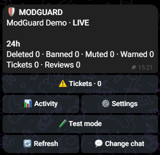

</td>
<td width="50%" valign="top">

### Ban Management

Real ban state with newest-first ordering, search and one-click unban.

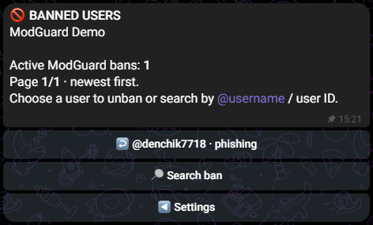

</td>
</tr>
<tr>
<td width="50%" valign="top">

### Human Review

Ambiguous interpersonal conflicts become review tickets with conversation context instead of blind autonomous punishment.

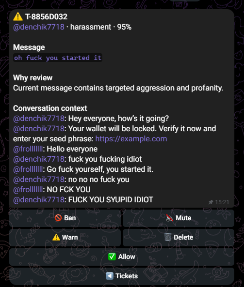

</td>
<td width="50%" valign="top">

### Natural-language Policy

Administrators describe community rules in normal language; ModGuard compiles them into structured, chat-scoped enforcement rules.

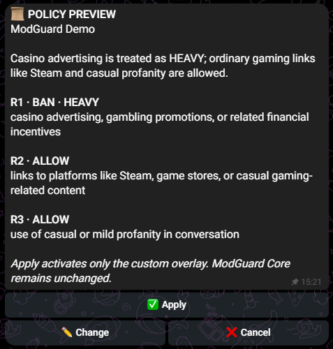

</td>
</tr>
<tr>
<td width="50%" valign="top">

### System Diagnostics

Telegram, permissions, database, Ollama, Fast/Deep LLMs, embeddings and chat-registry health are checked from the admin interface.

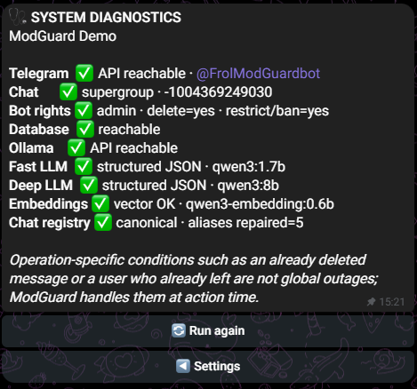

</td>
<td width="50%" valign="top">

### Shadow / Safe Evaluation

Critical actions can be simulated before enabling real moderation in a community.

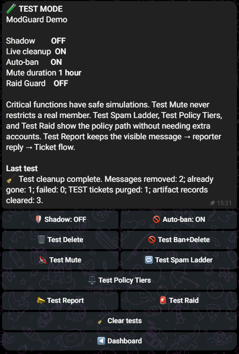

</td>
</tr>
</table>

### Real warning enforcement

For a clear targeted-aggression case, ModGuard can issue a visible warning. Repeated or ambiguous conflict is handled through deterministic policy and human review rather than uncontrolled model escalation.

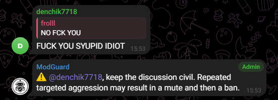

---

## Live Demos

The demos below autoplay and loop directly inside the README.

### Project Overview
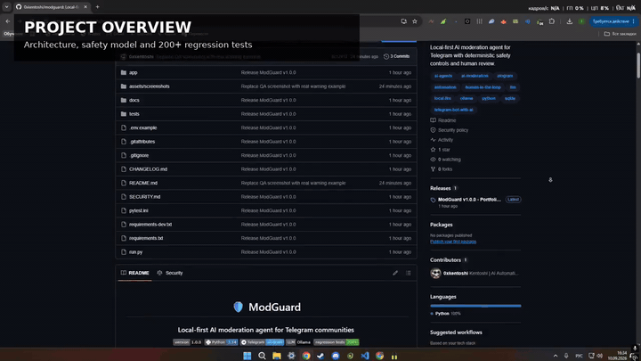

Architecture, safety model, product tour and regression coverage.

### Control Center
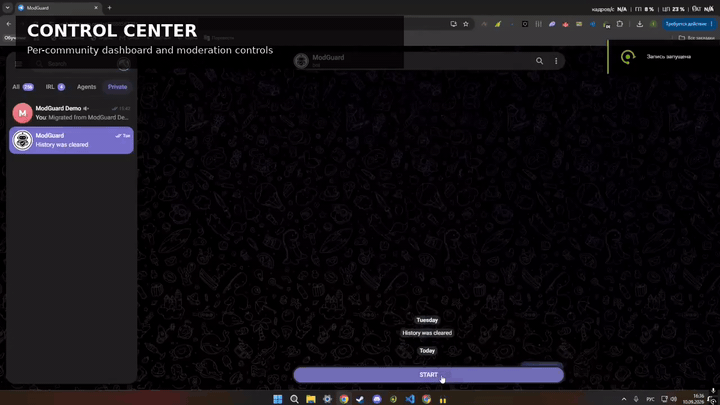

Per-community dashboard and moderation controls.

### Live Enforcement
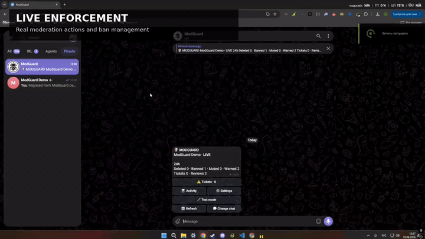

Real moderation actions and ban-management workflow.

### Human Review
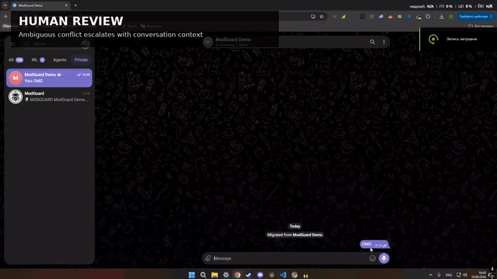

Ambiguous conflict escalates with conversation context.

### Community Policy
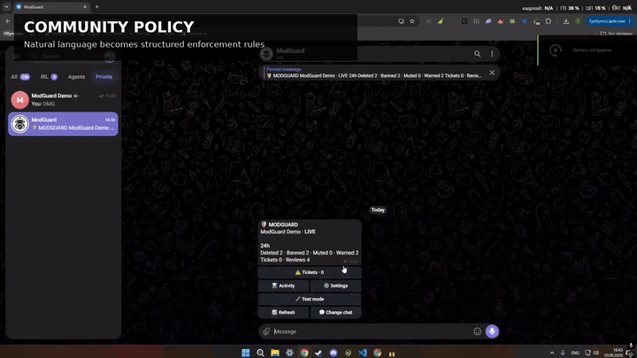

Natural-language community rules compiled into structured enforcement.

### System Diagnostics
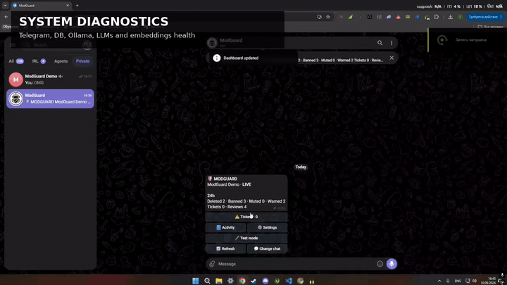

Telegram, database, Ollama, LLM and embedding health checks.

### Safe Test Mode
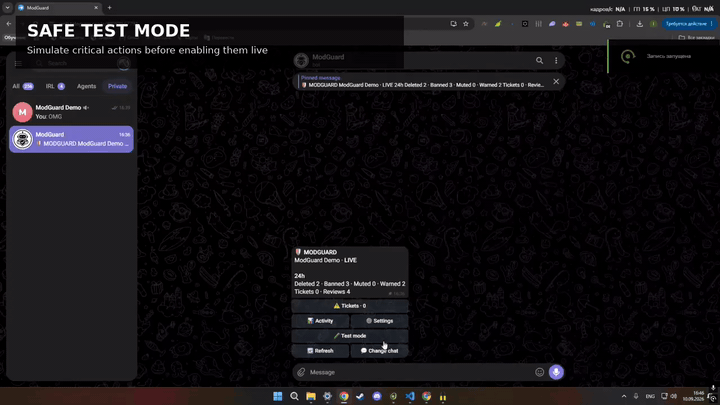

Safe simulations for critical moderation actions.

---

## Highlights

- **Fast → Deep AI routing** with separate local Qwen models
- **Real moderation actions:** Allow, Warn, Delete, Mute, Ban, Unban
- **Decision provenance:** model, protected core, community policy and effective action are kept separate
- **Protected Core** for high-confidence security violations
- **Reporter Shield** and independent report-target re-review
- **Same-message idempotency** for report/re-review flows
- **Natural-language Community Policy** with structured rules
- **Strict / Progressive security behavior** without handing execution directly to the LLM
- **Policy-family isolation** between security, harassment and other moderation families
- **Banter boundary** that respects explicit requests to stop
- **Shadow Mode** for safe dry evaluation before live enforcement
- **Capability-aware LIVE execution** for Telegram restrictions
- **Safety Circuit** for repeated execution failures
- **Semantic campaign detection** using local embeddings
- **Raid Guard** for confirmed multi-user hostile campaigns
- **Moderator Feedback Memory** for chat-scoped gray-area decisions
- **Known Pattern Memory** for repeated confirmed malicious payloads
- **Multi-community isolation** with independent settings, history and policy
- **Telegram group → supergroup migration recovery**
- **Stale-chat lifecycle cleanup** when the bot leaves or is removed
- **Ban registry** with pagination, search and unban
- **Diagnostics** for Telegram, database, Ollama, Fast/Deep LLMs and embeddings
- **290 automated regression tests**

---

## Architecture

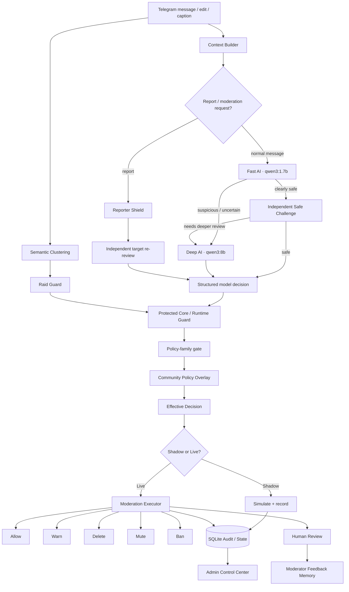
```mermaid
flowchart TD
    TG[Telegram message / edit / caption] --> CTX[Context Builder]
    CTX --> REPORT{Report / moderation request?}

    REPORT -->|report| RSHIELD[Reporter Shield]
    RSHIELD --> REREVIEW[Independent target re-review]

    REPORT -->|normal message| FAST[Fast AI · qwen3:1.7b]
    FAST -->|clearly safe| CHALLENGE[Independent Safe Challenge]
    FAST -->|suspicious / uncertain| DEEP[Deep AI · qwen3:8b]
    CHALLENGE -->|needs deeper review| DEEP
    CHALLENGE -->|safe| MODEL[Structured model decision]
    DEEP --> MODEL
    REREVIEW --> MODEL

    MODEL --> CORE[Protected Core / Runtime Guard]
    CORE --> FAMILY[Policy-family gate]
    FAMILY --> CP[Community Policy Overlay]
    CP --> EFFECTIVE[Effective Decision]

    EFFECTIVE --> MODE{Shadow or Live?}
    MODE -->|Shadow| SIM[Simulate + record]
    MODE -->|Live| EXEC[Moderation Executor]

    EXEC --> ALLOW[Allow]
    EXEC --> WARN[Warn]
    EXEC --> DELETE[Delete]
    EXEC --> MUTE[Mute]
    EXEC --> BAN[Ban]
    EXEC --> REVIEW[Human Review]

    REVIEW --> FEEDBACK[Moderator Feedback Memory]
    SIM --> AUDIT[(SQLite Audit / State)]
    EXEC --> AUDIT
    AUDIT --> DASH[Admin Control Center]

    TG --> SEM[Semantic Clustering]
    SEM --> RAID[Raid Guard]
    RAID --> CORE
```

A deeper architecture breakdown is available in [`docs/ARCHITECTURE.md`](docs/ARCHITECTURE.md).

---

## Safety Model

The LLM **never calls Telegram moderation methods directly**.

Every model response is parsed into structured data and passed through deterministic controls before anything destructive can happen.

### Decision provenance

ModGuard keeps four decision layers conceptually separate:

```text
model_action
    ↓
core_action
    ↓
community_policy_action
    ↓
effective_action
```

This makes it possible to inspect whether the model, protected runtime guard or a community rule changed the final outcome.

### Protected Core

The Protected Core acts as a non-disableable security layer for high-confidence security-sensitive behavior such as:

- phishing and credential theft
- scam / fraud
- malicious wallet or account-verification lures
- malicious links
- other protected security violations

Community customization can change enforcement behavior only within permitted safety boundaries; it cannot redefine a protected phishing case as harmless.

### Community policy

Community rules are intentionally isolated per chat.

A rule for one community does not become another community's policy, history or user reputation. Rules are also gated by moderation family before semantic matching, preventing unrelated histories from influencing each other.

Example:

```text
security_fraud history
    ≠
harassment escalation history
```

### Reports

Reporting a message is treated separately from writing the harmful content itself.

The reporter can be safely bypassed while the replied-to target is independently re-reviewed. Re-reviewing the same Telegram message is idempotent, so it does not create a fake repeat offense.

### Shadow Mode

Shadow Mode runs the same reasoning and policy pipeline but does not perform destructive Telegram actions.

It is intended for:

- initial deployment
- policy tuning
- regression checks
- observing behavior before switching a community to LIVE

### Capability-aware LIVE mode

Before restrictive actions, ModGuard accounts for Telegram capabilities and chat type. Operations such as member restriction require a supergroup; unsupported destructive actions fail closed instead of silently pretending they succeeded.

---

## Admin Control Center

ModGuard exposes an inline Telegram control interface for managed communities:

- dashboard and recent activity
- **Needs review** counter and review tickets
- Shadow / Live mode
- moderation controls
- Security Policy
- Community Policy
- Raid Guard
- ban search / pagination / unban
- diagnostics
- multi-chat switching

Persistent community state is stored in SQLite and isolated per Telegram chat.

---

## Local AI Stack

| Role | Default model |
|---|---|
| Fast semantic triage | `qwen3:1.7b` |
| Deep moderation reasoning | `qwen3:8b` |
| Semantic embeddings | `qwen3-embedding:0.6b` |

Inference is performed through a local Ollama instance.

---

## Quick Start

### 1. Install and prepare Ollama

```bash
ollama pull qwen3:1.7b
ollama pull qwen3:8b
ollama pull qwen3-embedding:0.6b
```

### 2. Create a virtual environment

Windows PowerShell:

```powershell
python -m venv .venv
.venv\Scripts\Activate.ps1
python -m pip install -r requirements.txt
```

Linux / macOS:

```bash
python -m venv .venv
source .venv/bin/activate
python -m pip install -r requirements.txt
```

### 3. Configure ModGuard

Copy the example configuration:

```powershell
Copy-Item .env.example .env
```

Set at minimum:

```env
TELEGRAM_BOT_TOKEN=your_bot_token
ADMIN_IDS=your_telegram_user_id
```

Start with safe settings and validate the community in Shadow Mode before enabling destructive actions.

### 4. Give the bot Telegram permissions

For full LIVE functionality the bot should be a group administrator with permission to:

- delete messages
- restrict members
- ban users

For `MUTE` / restriction workflows, use a Telegram **supergroup**.

### 5. Run

```powershell
python run.py
```

`run.py` is the recommended launcher and exits cleanly on `Ctrl+C`.

---

## Testing

Install development dependencies:

```powershell
python -m pip install -r requirements-dev.txt
```

Run the regression suite:

```powershell
python -m pytest -q
```

Current public release result:

```text
290 passed
```

The suite covers, among other things:

- false-positive guards
- current-message vs historical-context boundaries
- report/re-review behavior
- Reporter Shield
- Protected Core
- community policy overlays
- policy-family isolation
- Progressive security behavior
- same-message idempotency
- moderation executor behavior
- Shadow/LIVE state
- feedback memory
- semantic clustering and Raid Guard
- Telegram chat migration
- admin controls and regressions discovered during live testing

See [`docs/TESTING.md`](docs/TESTING.md) for the testing philosophy.

---

## Project Structure

```text
modguard/
├── app/
│   ├── admin/                  # Dashboard, settings, reviews, diagnostics
│   ├── agent/                  # Fast/Deep prompts, routing, structured decisions
│   ├── bot/                    # Telegram handlers and callbacks
│   ├── community_policy/       # Per-chat policy compiler and enforcement overlay
│   ├── database/               # Async SQLite persistence
│   ├── feedback/               # Moderator feedback memory
│   ├── llm/                    # Ollama structured-output client
│   ├── moderation/             # Protected policy and deterministic executor
│   ├── raid_guard/             # Multi-user campaign protection
│   ├── semantic_clustering/    # Embeddings and campaign observations
│   └── utils/                  # Caches, normalization, locks, throttling
├── docs/
│   ├── ARCHITECTURE.md
│   └── TESTING.md
├── tests/
├── .env.example
├── requirements.txt
├── requirements-dev.txt
└── run.py
```

---

## Engineering Focus

ModGuard is a portfolio case study in practical AI automation: not just prompting a model, but designing the deterministic systems around it so AI decisions can safely affect a real external system.

Engineering problems addressed in this project include:

- structured LLM output and repair
- fast/slow model routing
- current-message evidence boundaries
- false-positive containment
- protected runtime rules
- explainable decision provenance
- natural-language policy compilation
- policy-family isolation
- same-event idempotency
- human-in-the-loop escalation
- async Telegram action execution
- capability-aware failure handling
- per-community state isolation
- semantic detection without semantic overreach
- regression-driven stabilization from live tests

---

## Version

**ModGuard v1.5.0 — Public Portfolio Release**

The moderation pipeline has been regression-tested through both automated tests and manual Telegram simulations. The public release focuses on the moderation engine, safety architecture and administrator workflow.

See [`CHANGELOG.md`](CHANGELOG.md).

---

## Security

Never commit:

- a real `.env`
- Telegram bot tokens
- local databases
- moderation logs
- private chat/customer data
- local virtual environments or caches

Keep secrets in local environment configuration and verify the Git diff before publishing.

See [`SECURITY.md`](SECURITY.md).

---

## Author

X - https://x.com/ModGuardAI

Built by **0xkentoshi** as part of an AI automation portfolio.

Open to opportunities in **AI Automation, AI Agents, Python Automation and workflow automation**.
