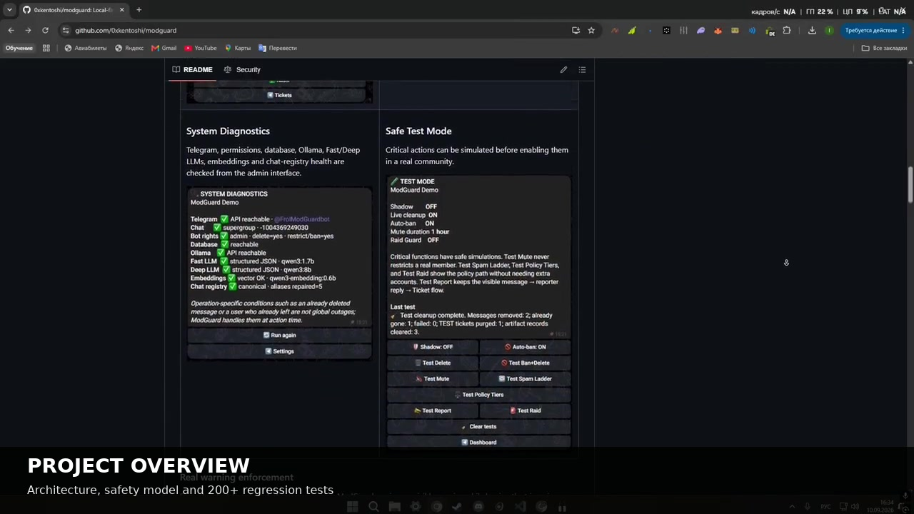
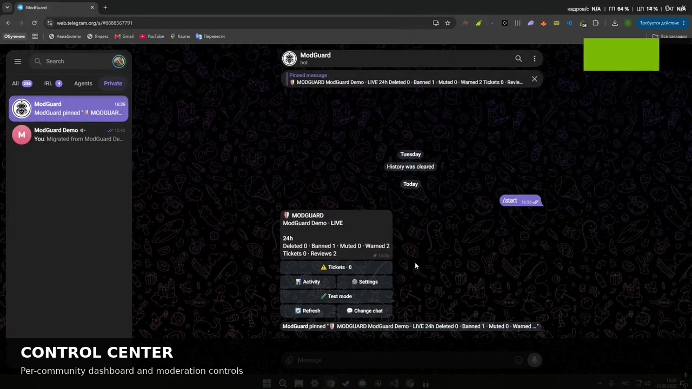
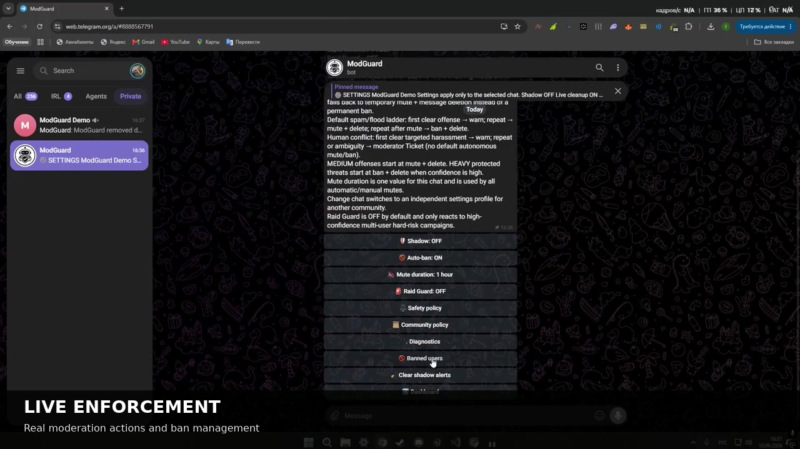
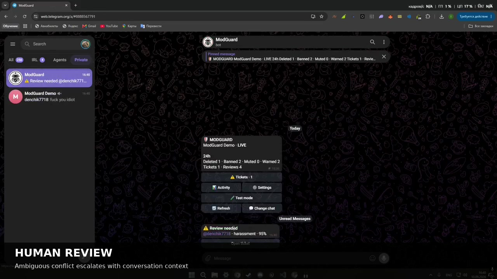
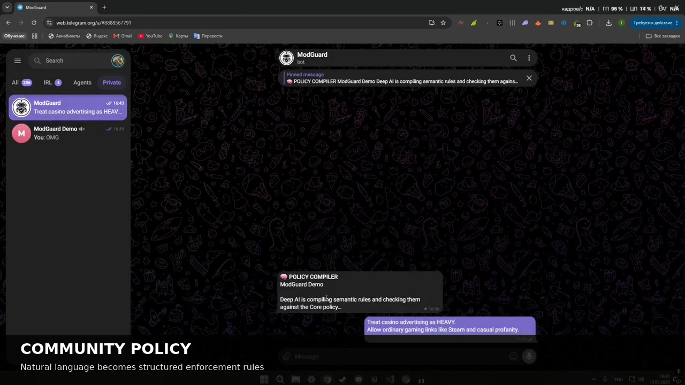
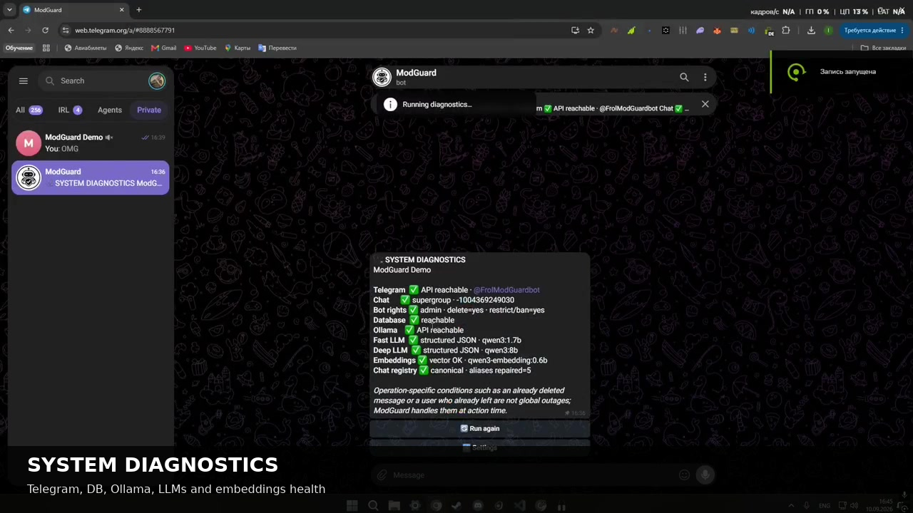
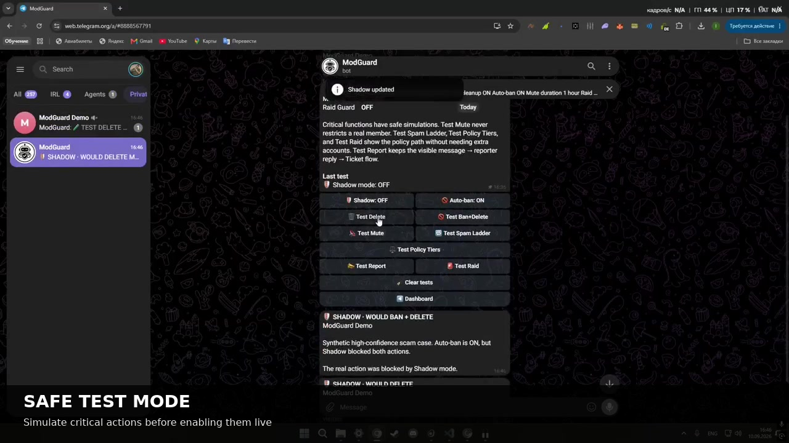

## Live Demos

These are continuous live recordings of the actual v1.0.0 workflows.  
Click a preview to open the corresponding video.

<table>
<tr>
<td width="50%" valign="top">

### Project Overview

Architecture, safety model, product tour and regression coverage.

</td>
<td width="50%" valign="top">

### Control Center

Per-community dashboard and moderation controls.

</td>
</tr>
<tr>
<td width="50%" valign="top">

### Live Enforcement

Real moderation actions and ban-management workflow.

</td>
<td width="50%" valign="top">

### Human Review

Ambiguous conflict escalates with conversation context.

</td>
</tr>
<tr>
<td width="50%" valign="top">

### Community Policy

Natural-language community rules compiled into structured enforcement.

</td>
<td width="50%" valign="top">

### System Diagnostics

Telegram, database, Ollama, LLM and embedding health checks.

</td>
</tr>
<tr>
<td width="50%" valign="top">

### Safe Test Mode

Safe simulations for critical moderation actions.

</td>
<td width="50%" valign="top">

### Full Live Walkthrough

[▶ Watch the full continuous ModGuard v1.0.0 demo](ModGuard_v1.0.0_Live_Demo.mp4)

All seven clips stitched in order. The individual workflows are not shortened further.

</td>
</tr>
</table>

---
